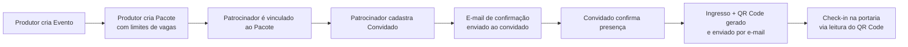
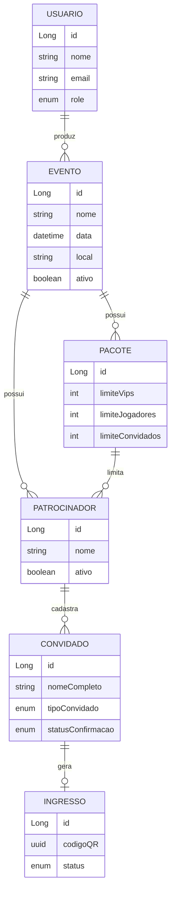

# 🎟️ Check-in API

Backend de um sistema de gestão de eventos e check-in, com fluxo completo de convite, confirmação de presença por e-mail e validação de entrada via QR Code. Desenvolvido em Java com Spring Boot, aplicando autenticação/autorização robusta (JWT + RBAC + controle por ownership) e boas práticas de arquitetura em camadas.

> Projeto de portfólio focado em modelagem de domínio, regras de negócio e segurança em uma API REST real.

## 📋 Sobre o projeto

O sistema permite que **produtores de evento** cadastrem eventos, definam pacotes de patrocínio (com limites de convidados VIP, jogadores e convidados comuns) e associem patrocinadores a esses pacotes. Cada patrocinador cadastra seus convidados, que recebem um e-mail de confirmação de presença. Ao confirmar, o convidado recebe automaticamente um **ingresso com QR Code** por e-mail, que é validado na portaria no momento do check-in.

**Fluxo principal:**



## 💡 De onde veio a ideia

A inspiração para esse projeto surgiu de uma experiência que tive como staff em um evento. Na ocasião, a entrada dos convidados era controlada por meio de uma planilha, o que acabava gerando filas, atrasos e algumas confusões durante o credenciamento. Além disso, também havia dificuldade para saber exatamente quem havia comparecido ao evento e obter informações como o total de participantes presentes. Pensando nisso, decidi desenvolver uma solução para tornar esse processo mais rápido, organizado e confiável — daí a API de check-in via QR Code.

O detalhe do `TipoConvidado` veio de outro evento do qual participei, um networking privado (só para convidados): cada patrocinador montava um time, e enquanto as pessoas faziam networking rolava em paralelo um campeonato de futebol entre os times dos patrocinadores. É por isso que o `TipoConvidado` tem três categorias e não só "VIP" e "comum": **`JOGADOR`** representa quem joga pelo time do patrocinador, separado de **`VIP`** (convidado especial do patrocinador) e **`CONVIDADO_COMUM`**. Cada `Pacote` define limites independentes para cada tipo (`limiteJogadores`, `limiteVips`, `limiteConvidados`), simulando a lógica real do evento: um patrocinador contrata um pacote que dá direito a X jogadores pro time, Y convidados VIP e Z convidados comuns.

## ✅ Funcionalidades

- **Gestão de eventos**: CRUD de eventos, com controle de propriedade (apenas o produtor dono ou um admin pode editar/excluir)
- **Pacotes de patrocínio**: definição de limites de vagas por tipo de convidado (VIP, jogador, convidado comum)
- **Patrocinadores e convidados**: cadastro de patrocinadores por evento e convidados por patrocinador, com validação automática de limite de vagas do pacote
- **Confirmação de presença por e-mail**: link único de confirmação (token) enviado ao convidado
- **Emissão de ingresso com QR Code**: geração automática (ZXing) após confirmação, com envio por e-mail (template Thymeleaf)
- **Check-in por QR Code**: validação do código na portaria, com transição de status do ingresso (`VALIDO` → `UTILIZADO`)
- **Autenticação JWT** com registro/login de usuários
- **Autorização em duas camadas**:
  - **RBAC** por papel (`ADMIN`, `PRODUTOR`, `PORTARIA`, `CLIENTE`)
  - **OBAC** (ownership-based) — um produtor só gerencia os próprios eventos, pacotes, patrocinadores e ingressos
- **Sanitização de HTML** (OWASP Java HTML Sanitizer) na descrição do evento, prevenindo XSS
- **Documentação interativa** via Swagger/OpenAPI
- **Migrations versionadas** com Flyway (6 migrations aplicadas)
- **Tratamento de exceções centralizado** (`ResourceNotFoundException`, `ResourceAlreadyExistsException`, `BusinessException`)

## 🧱 Modelo de domínio



## 🛠️ Tecnologias

| Categoria | Tecnologias |
|---|---|
| Linguagem / Framework | Java 21, Spring Boot |
| Persistência | Spring Data JPA, PostgreSQL, Flyway |
| Segurança | Spring Security, JWT (java-jwt), BCrypt |
| Documentação | springdoc-openapi (Swagger UI) |
| E-mail | Spring Mail, Thymeleaf (templates de e-mail) |
| QR Code | ZXing (Google) |
| Segurança de conteúdo | OWASP Java HTML Sanitizer |
| Utilitários | Lombok |
| Build | Maven |

## 🔐 Segurança e permissões

A autorização combina **papel do usuário** com **posse do recurso**, usando `@PreAuthorize` e um bean customizado (`eventSecurity`):

| Papel | Permissões |
|---|---|
| `ADMIN` | Acesso total a todos os eventos e recursos |
| `PRODUTOR` | Cria e gerencia apenas os próprios eventos, pacotes, patrocinadores e ingressos |
| `PORTARIA` | Realiza check-in de qualquer ingresso via QR Code |
| `CLIENTE` | Acesso básico autenticado |

Rotas públicas: listagem/detalhe de eventos, listagem de patrocinadores de um evento, confirmação de presença via token e documentação Swagger. As demais exigem token JWT válido.

## 📡 Principais endpoints

| Método | Rota | Acesso |
|---|---|---|
| `POST` | `/auth/register` | Público |
| `POST` | `/auth/login` | Público |
| `POST` | `/evento` | `PRODUTOR` / `ADMIN` |
| `GET` | `/evento`, `/evento/{id}` | Público |
| `PUT` / `DELETE` | `/evento/{id}` | Dono do evento / `ADMIN` |
| `GET` | `/evento/meus-eventos` | Autenticado |
| `POST` | `/evento/{eventoId}/pacote` | Dono do evento / `ADMIN` |
| `GET` | `/evento/{eventoId}/pacotes`, `/evento/pacote/{id}` | Dono do evento / `ADMIN` |
| `POST` | `/evento/{eventoId}/patrocinador` | Dono do evento / `ADMIN` |
| `GET` | `/evento/{eventoId}/patrocinadores` | Público |
| `GET` | `/evento/patrocinador/{id}` | Dono do evento / `ADMIN` |
| `POST` | `/patrocinador/{patrocinadorId}/convidado` | Dono do evento / `ADMIN` |
| `GET` | `/patrocinador/{patrocinadorId}/convidados` | Dono do evento / `ADMIN` |
| `GET` | `/patrocinador/confirmar?token=` | Público |
| `GET` | `/evento/ingressos` | `ADMIN` |
| `POST` | `/evento/ingressos/checkin` | `PORTARIA` / `ADMIN` / dono do evento |

Documentação completa e testável em `/swagger-ui.html` (com o servidor rodando).

## 🚀 Rodando localmente

### Pré-requisitos
- Java 21+
- Maven (ou use o wrapper `./mvnw`)
- PostgreSQL rodando localmente (porta padrão), banco `checkin`
- Uma conta de e-mail SMTP (ex.: Gmail com senha de app) para envio das confirmações

### Variáveis de ambiente

Crie um `application-local.yaml` (já ignorado pelo Git) ou exporte as variáveis abaixo:

```yaml
spring:
  mail:
    username: ${MAIL_USERNAME}
    password: ${MAIL_PASSWORD}
  datasource:
    password: ${DB_PASSWORD}
api:
  security:
    token:
      secret: ${JWT_SECRET}
```

### Executando

```bash
# clonar o repositório
git clone https://github.com/vtzada/sistema-de-checkin.git
cd sistema-de-checkin

# rodar as migrations e subir a aplicação
./mvnw spring-boot:run
```

A API sobe em `http://localhost:8080`. As migrations do Flyway rodam automaticamente na inicialização.

## 🗺️ Possíveis evoluções

- Testes automatizados (unitários e de integração)
- Paginação nas listagens
- Deploy containerizado (Docker)
- Refresh token / expiração e renovação de sessão

## 👤 Autor

**Vitor Theodoro da Fonseca**
Desenvolvedor Backend Java/Spring Boot
[GitHub](https://github.com/vtzada)
